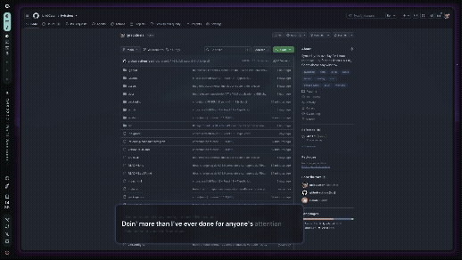

<div align="center">


# LyricsLens

**Letras sincronizadas sobre qualquer aplicativo.**

Detecta o que está tocando no sistema, busca a letra e a mostra numa janela
flutuante — acompanhando a música palavra por palavra.

[English](README.md) | **Português**

[](https://github.com/Julio0Cesar/lyricslens/actions/workflows/ci.yml)
[](https://github.com/Julio0Cesar/lyricslens/releases)
[](LICENSE)

</div>

<!-- #20 — o GIF do overlay em funcionamento entra aqui, logo abaixo do título.
     Grave ~5s com música tocando, a letra acompanhando palavra por palavra,
     sobre alguma janela qualquer. Salve em assets/demo.gif e troque este
     comentário por:

     <div align="center"></div>

     Uma segunda imagem da janela de configurações (assets/settings.png) entra
     na seção Uso. -->

---

## Instalação

> **Linux · x86_64 · Wayland ou X11.** Windows ainda não ([#5](https://github.com/Julio0Cesar/lyricslens/issues/5)).

### Debian, Ubuntu, Mint

Baixe o `.deb` em [Releases](https://github.com/Julio0Cesar/lyricslens/releases/latest) e:

```bash
sudo apt install ./lyricslens-x86_64.deb
```

### Fedora, openSUSE

Baixe o `.rpm` em [Releases](https://github.com/Julio0Cesar/lyricslens/releases/latest) e:

```bash
sudo dnf install ./lyricslens-x86_64.rpm
```

O `apt install ./arquivo.deb` e o `dnf install ./arquivo.rpm` resolvem as
dependências. O `dpkg -i` e o `rpm -i` não — eles falham com *unmet
dependencies* e deixam o pacote meio-instalado.

### Arch, NixOS, ou sem sudo

O script instala em `~/.local`, sem tocar em nada fora da sua pasta:

```bash
curl -fsSL https://raw.githubusercontent.com/Julio0Cesar/lyricslens/main/install.sh | sh
```

Se preferir ler antes de executar — e é uma boa ideia:

```bash
curl -fsSL https://raw.githubusercontent.com/Julio0Cesar/lyricslens/main/install.sh -o install.sh
less install.sh && sh install.sh
```

Depois é só apertar **Super** e procurar por *LyricsLens*. Para remover:

```bash
curl -fsSL https://raw.githubusercontent.com/Julio0Cesar/lyricslens/main/install.sh | sh -s -- --remove
```

### Conferir o download

Cada release publica um `SHA256SUMS`. O `install.sh` já o confere sozinho; para
verificar um pacote baixado na mão:

```bash
curl -LO https://github.com/Julio0Cesar/lyricslens/releases/latest/download/SHA256SUMS
sha256sum -c SHA256SUMS --ignore-missing
```

## Requisitos

- Linux, x86_64
- `webkit2gtk-4.1`, `gtk3`, `libayatana-appindicator`, `gtk-layer-shell` — o
  `.deb` e o `.rpm` puxam sozinhos; o AppImage já os traz dentro
- Um player que exponha MPRIS: Spotify, Chromium, Firefox, VLC…

### Compatibilidade por ambiente gráfico

Em Wayland quem manda na janela é o compositor, então o comportamento varia. A
tabela diz o que foi de fato testado:

| Ambiente | Overlay | Sempre por cima | Posição automática | Atalho global |
|---|---|---|---|---|
| Hyprland (Wayland) | ✅ | ✅ | ✅ | ✅ via `hyprctl` |
| Sway, river e outros wlroots | não testado ¹ | não testado ¹ | ❌ | manual |
| KDE Plasma (Wayland) | não testado | não testado | ❌ | manual |
| GNOME (Wayland) | não testado | ❌ ² | ❌ | manual |
| X11 (qualquer WM) | não testado | não testado | ❌ | manual |

Só o Hyprland foi testado de verdade. O resto é o que se espera pelo protocolo,
não relato de uso — se você rodar em algum deles, um comentário na
[#24](https://github.com/Julio0Cesar/lyricslens/issues/24) preenche a linha.

¹ Devem funcionar pelo `wlr-layer-shell`, que esses compositores implementam.
² O GNOME não implementa `wlr-layer-shell`, então o overlay cai para janela
comum e não consegue ficar acima de tela cheia.

*Posição automática* e *atalho global* hoje só conhecem o Hyprland — em
qualquer outro ambiente, use o keybind do seu sistema chamando `lyricslens
toggle` (ver [Uso](#uso)). Ampliar isso é a
[#12](https://github.com/Julio0Cesar/lyricslens/issues/12); linha em branco na
tabela é pedido de ajuda, não esquecimento.

## Uso

O app vive na bandeja do sistema. Fechar a janela **esconde** o overlay; sair é
decisão explícita, pelo menu da bandeja.

| Ação | Como |
|---|---|
| Mostrar / esconder | Clique no ícone da bandeja, ou o atalho global |
| Abrir configurações | **Duplo clique** no overlay |
| Fechar configurações | **Duplo clique** fora dos controles |
| Mover o overlay | Arraste |
| Corrigir a letra errada | Configurações → *Letra desta faixa* |

### Atalho global

Em **Configurações → Comportamento → Atalho global**, pressione a combinação que
quiser.

Wayland não deixa um aplicativo registrar um atalho de sistema — quem registra é
o compositor. No Hyprland o app pede isso via `hyprctl`, apontando de volta para
o próprio executável. Nada é escrito na sua configuração: o compositor esquece o
atalho ao reiniciar e o app o reaplica toda vez que sobe.

Em outros ambientes, use o keybind do seu sistema chamando:

```bash
lyricslens toggle     # mostra ou esconde
lyricslens settings   # abre as configurações
lyricslens hide
lyricslens            # mostra
```

### Relatar um problema

App aberto pelo menu não tem `stderr` visível, então as falhas vão para um
arquivo de log. Estes dois respondem quase tudo o que um relato precisa:

```bash
lyricslens --version
lyricslens --paths     # onde ficam log, cache e preferências
```

O log fica em `~/.local/state/lyricslens/`, rotaciona em 1 MiB e guarda um
arquivo anterior. Falhas em que você pode agir — atalho que o compositor
recusou, busca de letra que não chegou ao LRCLIB — também aparecem na janela de
configurações.

## Como funciona

```
MPRIS (D-Bus) ──▶ detecção da faixa ──▶ busca da letra (LRCLIB) ──▶ cache local
                                                                       │
                                                    engine de sync ────┘
                                                           │
                                                    overlay (React)
```

O backend em Rust é dono do estado e do relógio; o frontend apenas desenha e
interpola entre os ticks.

Duas decisões carregam o resto do projeto, e as duas vieram de medição, não de
palpite — o raciocínio está em [`docs/ARCHITECTURE.md`](docs/ARCHITECTURE.md):

- **A posição da música é ancorada na *borda*, não na leitura.** Várias fontes
  reportam a posição arredondada para o segundo. Ancorar no instante em que o
  valor vira derruba o erro de ±1000ms para ±71ms.
- **Em Wayland, quem manda na janela é o compositor.** Ficar por cima, escolher
  posição, registrar atalho — nada disso o aplicativo pode fazer sozinho. Tudo
  passa por pedido ao compositor.

## Status

| Área | Estado |
|---|---|
| Detecção de mídia (MPRIS) | pronto |
| Letras sincronizadas (LRCLIB) | pronto |
| Overlay always-on-top | pronto, inclusive sobre tela cheia |
| Bandeja + atalho global | pronto |
| Cache local (SQLite) | pronto |
| Janela de configurações | pronto |
| Escolha manual da letra | pronto |
| Modo offline | [#2](https://github.com/Julio0Cesar/lyricslens/issues/2) |
| Capa do álbum | [#3](https://github.com/Julio0Cesar/lyricslens/issues/3) |
| Interface em inglês | pronto, segue o seu `LANG` |
| Tradução das letras | [#1](https://github.com/Julio0Cesar/lyricslens/issues/1) |
| Windows | [#5](https://github.com/Julio0Cesar/lyricslens/issues/5) |

## Desenvolvimento

```bash
pnpm install
pnpm tauri dev
```

```bash
cd src-tauri && cargo test    # 96 testes
pnpm test           # 68 testes
pnpm exec tsc --noEmit
```

### Versionamento

As versões saem sozinhas dos commits, seguindo
[Conventional Commits](https://www.conventionalcommits.org/pt-br/):

| Prefixo | Efeito em `X.Y.Z` |
|---|---|
| `fix:` | `Z` |
| `feat:` | `Y` |
| `feat!:` ou `BREAKING CHANGE:` | `X` |
| `docs:`, `chore:`, `test:` | nenhum |

Ao entrar na `main`, o `release-please` abre um PR de release com o CHANGELOG e
a versão nova. Quando esse PR é aprovado, a tag é criada, os pacotes são
construídos, instalados em contêiner limpo para conferência e só então
publicados.

## Licença

[MIT](LICENSE)
